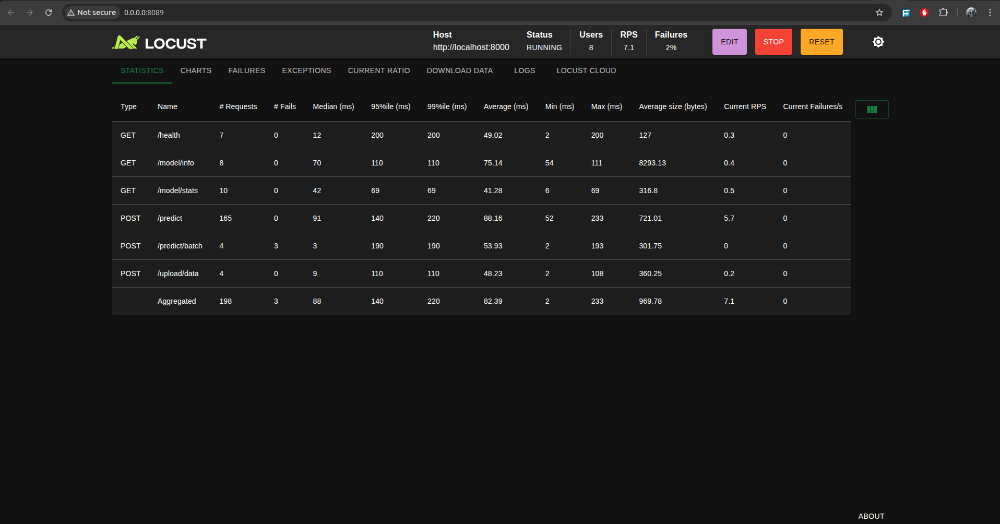

#  Lesly Ndizeye Predictor - CIFAR-10 Image Classification Pipeline

## 🎯 Objective

To demonstrate the full Machine Learning lifecycle using image data (CIFAR-10), including model training, evaluation, deployment, retraining, and monitoring, all wrapped with an API and UI for real-time usage.

---

## 📁 Project Structure

```
lesly-cifar10-image-classifier/
├── app/ (Frontend - Next.js)
├── data/
│   ├── train/
│   └── test/
├── notebook/
│   └── cifar10_model_dev.ipynb
├── src/
│   ├── preprocessing.py
│   ├── model.py
│   └── prediction.py
├── models/
│   └── cifar10_model.h5
├── scripts/
│   ├── api_server.py
│   └── locust_load_test.py
├── Dockerfile
├── docker-compose.yml
└── requirements.txt
├── README.md
```

---

## 🚀 How to Set Up

### 1. Clone the Repository

```bash
git clone https://github.com/Leslyndizeye/cifar10-image-classifier.git
cd cifar10-image-classifier
```

### 2. Backend Setup (FastAPI)

```bash
python3 -m venv venv
source venv/bin/activate
pip install -r requirements.txt
python3 scripts/api_server.py
```

* API Docs: [http://localhost:8000/docs](http://localhost:8000/docs)

### 3. Frontend Setup (Next.js)

```bash
cd app
npm install
npm run dev
```

* App UI: [http://localhost:3000](http://localhost:3000)

### 4. Load Testing with Locust

```bash
cd scripts
locust -f locust_load_test.py --host http://localhost:8000
```
``Here are results from Flood Request Simulation: LOCUST``



* Monitoring Dashboard: [http://localhost:8089](http://localhost:8089)

---

## 🧪 Features & Functionalities

### ✅ Model Prediction

* Upload an image
* Predict its class (CIFAR-10)
* Real-time prediction results

### 📈 Visualizations

* Class distribution
* Confidence scores
* Model performance metrics

### 📤 Upload Data

* Bulk upload up to 1000 images for retraining

### 🔁 Model Retraining

* Trigger retraining after upload
* Retrains using pseudo-labels
* Saves new model with timestamp

### 📊 Monitoring (Locust)

* Simulates load
* Tracks latency, RPS, and failures

---

## 📊 Evaluation Metrics Used

In the `notebook/cifar10_model_dev.ipynb`:

* Accuracy
* Precision
* Recall
* F1 Score
* Confusion Matrix

---

## 🔐 Deployment

* Backend (FastAPI) hosted locally/cloud
* Frontend (Next.js) deployed on Vercel
* Model versioning supported (.h5 format)

---

## 📹 Video Demo (Link)

📺 [YouTube Link][(https://youtu.be/ebuoJ0lXmtA)]

---

## 🔗 Links

* 🌐 App: [https://lesly-image-classifier-5b56.vercel.app](https://lesly-image-classifier-5b56.vercel.app)
* 📂 GitHub: [https://github.com/Leslyndizeye/cifar10-image-classifier](https://github.com/Leslyndizeye/cifar10-image-classifier)

---

## 🛠️ Tech Stack

* TensorFlow & Keras
* FastAPI
* React & Next.js
* TailwindCSS
* Locust
* Docker
